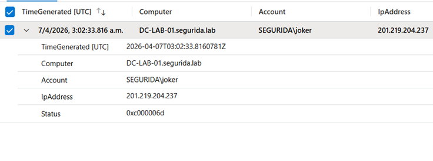
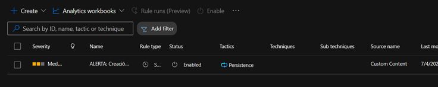
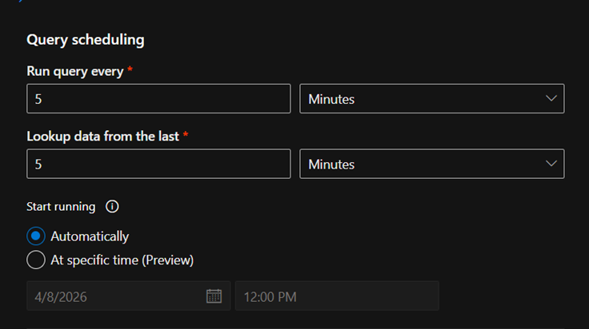
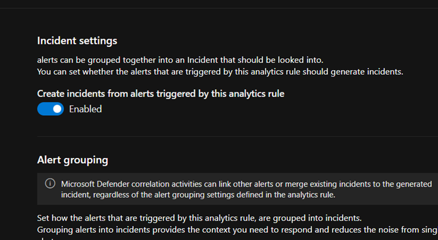
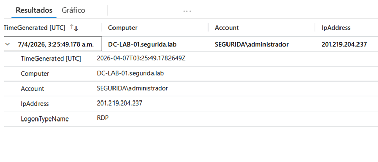
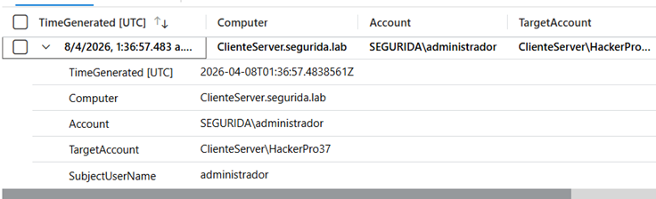
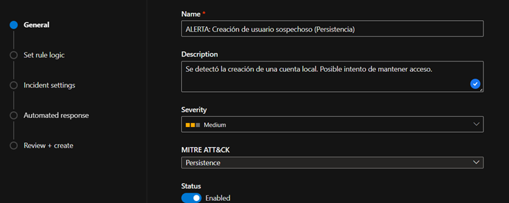

# 🛡️ Laboratorio SIEM — Microsoft Sentinel & Defender en Azure

> **Laboratorio práctico de detección de amenazas** sobre infraestructura real en Microsoft Azure.  
> Extensión del [Azure AD Identity Lab](https://github.com/julianamell2/Azure-AD-Identity-Lab) con incorporación de SIEM, reglas analíticas automáticas y gestión de incidentes.

---

## 📋 Resumen

| Campo | Detalle |
|-------|---------|
| **Analista** | Julián Amell Romero |
| **Fecha** | Abril 2026 |
| **Plataforma** | Microsoft Azure |
| **Infraestructura** | 2 VMs Windows Server 2022 + Active Directory |
| **SIEM** | Microsoft Sentinel |
| **Gestión de incidentes** | Microsoft Defender (portal unificado) |
| **Escenarios documentados** | 4 |
| **Técnicas MITRE cubiertas** | T1110 (Fuerza bruta) · T1021 (RDP) · T1136 (Persistencia) |

---

## 🏗️ Arquitectura del Entorno

```
┌─────────────────────────────────────────────────────────┐
│                    MICROSOFT AZURE                       │
│                                                         │
│  ┌──────────────┐    ┌──────────────┐                   │
│  │  VM — DC01   │    │  VM — CLIENT │                   │
│  │ Windows Srv  │    │ Windows Srv  │                   │
│  │ 2022 (AD DS) │    │    2022      │                   │
│  │     AMA ↓    │    │     AMA ↓    │                   │
│  └──────┬───────┘    └──────┬───────┘                   │
│         │                  │                            │
│         └────────┬──────────┘                           │
│                  ↓                                      │
│     ┌────────────────────────┐                          │
│     │  Log Analytics         │                          │
│     │  Workspace             │                          │
│     │  (tabla SecurityEvent) │                          │
│     └────────────┬───────────┘                          │
│                  ↓                                      │
│     ┌────────────────────────┐                          │
│     │  Microsoft Sentinel    │ ← Reglas KQL automáticas │
│     └────────────┬───────────┘                          │
│                  ↓                                      │
│     ┌────────────────────────┐                          │
│     │  Microsoft Defender    │ ← Incidentes generados   │
│     └────────────────────────┘                          │
└─────────────────────────────────────────────────────────┘
```

### Componentes desplegados

| Componente | Tecnología |
|-----------|-----------|
| SIEM | Microsoft Sentinel |
| Gestión de incidentes | Microsoft Defender (portal unificado) |
| Workspace de logs | Log Analytics Workspace |
| Agente de recolección | Azure Monitor Agent (AMA) |
| Conector activo | Windows Security Events |
| Sistema operativo | Windows Server 2022 |
| Directorio | Active Directory Domain Services |
| Lenguaje de consulta | KQL (Kusto Query Language) |
| Automatización | Reglas Analíticas Programadas |

---

## 🔍 Escenarios de Detección

### Escenario 1 — Login con Usuario Inexistente (Event ID 4625)

**Técnica MITRE:** T1110 — Brute Force  
**Gravedad:** Baja (intento único) → Alta (patrón masivo)

**Descripción:** Se intentó iniciar sesión con la cuenta `joker` (inexistente en el dominio). Sentinel capturó el evento en tiempo real.

**Consulta KQL:**
```kql
SecurityEvent
| where EventID == 4625
| where Account has "joker"
| project TimeGenerated, Computer, Account, IpAddress, Status
```


**Campos relevantes:**
- `TimeGenerated`: 07/04/2026 03:02:33.816 UTC
- `EventID`: 4625
- `Account`: joker (cuenta inexistente)

> ⚠️ En producción: crear alerta si Event ID 4625 supera 10 intentos en 5 minutos desde la misma IP.

---

### Escenario 2 — Sesión RDP Remota (Event ID 4624 / LogonType 10)

**Técnica MITRE:** T1021.001 — Remote Desktop Protocol  
**Gravedad:** Media — requiere monitoreo continuo

**Descripción:** Detección de acceso por Escritorio Remoto (RDP) al servidor. El LogonType 10 identifica sesiones RemoteInteractive.

**Consulta KQL:**
```kql
SecurityEvent
| where EventID == 4624
| where LogonType == 10
| project TimeGenerated, Computer, Account, IpAddress, LogonTypeName = "RDP"
```


> ⚠️ En producción: alerta para accesos RDP fuera de horario o desde IPs no autorizadas. Correlacionar con Event ID 4625 para detectar fuerza bruta exitosa seguida de acceso remoto.

---

### Escenario 3 — Creación de Cuenta Sospechosa (Event ID 4720)

**Técnica MITRE:** T1136 — Create Account (Persistencia)  
**Gravedad:** Alta — táctica de persistencia post-compromiso

**Descripción:** Simulación de un atacante que crea una cuenta nueva para mantener acceso al sistema tras el compromiso inicial. La consulta identifica tanto la cuenta creada como la cuenta que la originó.

**Consulta KQL:**
```kql
SecurityEvent
| where TimeGenerated > ago(1h)
| where EventID == 4720
| project TimeGenerated, Computer, Account, TargetAccount, SubjectUserName
```


**Campos forenses clave:**
- `TargetAccount`: cuenta nueva creada (el implante del atacante)
- `SubjectUserName`: cuenta que ejecutó la creación (quién lo hizo)

> ⚠️ En producción: alerta inmediata ante cualquier Event ID 4720 fuera de ventanas de mantenimiento aprobadas.

---

### Escenario 4 — Regla Analítica Automática en Microsoft Defender ⭐

**Nivel:** Automatización SOC  
**Componente clave:** Regla Analítica Programada (KQL)

**Descripción:** Implementación de detección automática sin intervención manual. Se creó una Regla Analítica Programada en Microsoft Defender conectada a Sentinel que ejecuta KQL sobre la tabla SecurityEvent y genera incidentes automáticamente.

### Configuración de la regla analítica


### KQL de la regla automática


### Programación — cada 5 minutos


### Creación de incidentes activada


### Regla activa en Sentinel


### Incidente generado automáticamente en Defender


### Detalle del incidente


**Flujo completo:**

```
Evento Windows (4720)
       ↓
Azure Monitor Agent (AMA)
       ↓
Log Analytics Workspace (tabla SecurityEvent)
       ↓
Regla Analítica KQL (programada en Sentinel)
       ↓
Incidente automático en Microsoft Defender
```

**Validación:** Al crear un usuario de prueba en el servidor, el incidente apareció automáticamente en el portal de Incidents de Microsoft Defender sin ninguna acción manual.

> 💡 Esta es la diferencia entre consultar logs manualmente y operar un SOC real. La regla analítica es el componente que lleva la detección a producción.

---

## 🗺️ Cobertura MITRE ATT&CK

| Táctica | Técnica | Event ID | Escenario |
|---------|---------|----------|-----------|
| Acceso Inicial | T1110 — Brute Force | 4625 | Escenario 1 |
| Movimiento Lateral | T1021.001 — RDP | 4624 (LogonType 10) | Escenario 2 |
| Persistencia | T1136 — Create Account | 4720 | Escenarios 3 y 4 |

---

## 📄 Documentación

- 📊 [Informe de Incidente Completo (PDF)](./Informe_Incidente_Sentinel_COMPLETO.pdf) — 4 escenarios documentados con análisis técnico, consultas KQL y conclusiones
- 🖼️ [Evidencias visuales](./imagenes/) — Capturas del entorno, Sentinel y portal de Defender

---

## 🔗 Laboratorio relacionado

👉 **[Azure AD Identity Lab](https://github.com/julianamell2/Azure-AD-Identity-Lab)** — Infraestructura base: Active Directory híbrido con Microsoft Entra Connect, RBAC, GPO, AppLocker y auditoría SOC.

Este repositorio es la segunda fase de ese laboratorio.

---

## 🧰 Stack completo

`Microsoft Sentinel` · `Microsoft Defender` · `Log Analytics Workspace` · `Azure Monitor Agent` · `Windows Server 2022` · `Active Directory DS` · `KQL` · `Microsoft Azure` · `Windows Security Events` · `Reglas Analíticas`

---

<div align="center">

**Julián Amell Romero**  
IAM & Azure Security | Blue Team | AZ-900 · Google IT Support  
[LinkedIn](https://www.linkedin.com/in/julián-amell-romero-55bb703b5/) · [Azure AD Identity Lab](https://github.com/julianamell2/Azure-AD-Identity-Lab)

</div>

